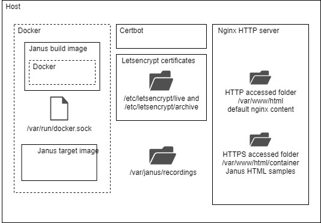

# Janus container [work in progress]

## Introduction
This is an experimental project attempting to put Janus gatweay into a Docker container using the default *bridge* network driver. The strategy is to 
create a build OCI image that will run the Docker tools as well as the Janus build environment. The build image will compile and create the target Janus gateway 
image stored on the host image repository. This process allows to create a substantially smaller target Janus gateway immage (~300MB vs 1.3GB). 
This process requires the setup of a Docker host that purpose is to store the buld and target images as well as to allow the execution of the target image. 

## Host setup
The figure below depicts the host configuration.

The host contains the following componets:
* Docker engine for executing the build and target images.
* Nginx HTTP server for allowing Certbot automatic Letsencrypt certificates update and for serving the Janus HTML samples
* Cetbot 


## Process
The 


## Installation procedure
This section provides the default installation procedure. This is a single host installation, the host will allow to build and run the 
docker image. The default configuration allows to access the server only through HTTPs using the host's obtanied Letsencrypt certificates. 
Please note that this project is using Ubuntu 18.04-LTS Linux distribution. Although it has been tried 
only on that specific distribution, a priori, there are no reasons for it not to work on any other fairly recent distribution.

### Build/docker experimental host installation
First let's install a Janus host for building and running the docker image. 
1. Install Ubuntu 18.04 physical or virtual host with the default packages and using the default parameters. Make sure that you have 
access to a sudo capable user. We assume that the host is directly connected to the internet through a 1-to-1 NAT. 
	1. Make sure that the 1-to-1 NAT redirects the following ports: 80 (http), 443 (https), 8089 (janus-api), 7889 (janus-admin) to the Janus host.
	1. Reserve a name for your host in your domain (e.g. <host>.<domain>) and update the */etc/hosts* file accordingly
		```bash
		127.0.0.1 localhost <host>.<domain>
		[...]
		```
1. Install docker following [these](https://docs.docker.com/engine/install/ubuntu/) instructions then follow [these](https://docs.docker.com/engine/install/linux-postinstall/)
steps for some additional convenience settings.
1. Install Nginx HTTP server. We need NGINX to automate the [Letsencrypt](https://letsencrypt.org/) certificate updates using the 
[Certbot](https://certbot.eff.org/) and for serving the janus html examples (from the /var/www/html/container directory) 
	```bash
	sudo apt install nginx
	sudo apt update
	```
1. Install the TLS certificates and the automatic certificate update service
	1. Add the Certbot PPA to your list of repositories
		```bash
		sudo apt install software-properties-common
		sudo add-apt-repository universe
		sudo add-apt-repository ppa:certbot/certbot
		sudo apt update
		```
	1. Install Certbot
		```bash
		sudo apt install certbot python-certbot-nginx
		```
	1. Get the certificates
		>>>
		<b>sudo certbot certonly --nginx</b>
		
		Saving debug log to /var/log/letsencrypt/letsencrypt.log
		Plugins selected: Authenticator nginx, Installer nginx
		Enter email address (used for urgent renewal and security notices) (Enter 'c' to
		cancel): <b>\<your e-mail address\></b>

		- - - - - - - - - - - - - - - - - - - - - - - - - - - - - - - - - - - - - - - -
		Please read the Terms of Service at
		https://letsencrypt.org/documents/LE-SA-v1.2-November-15-2017.pdf. You must
		agree in order to register with the ACME server at
		https://acme-v02.api.letsencrypt.org/directory
		- - - - - - - - - - - - - - - - - - - - - - - - - - - - - - - - - - - - - - - -
		(A)gree/(C)ancel: <b>A</b>

		- - - - - - - - - - - - - - - - - - - - - - - - - - - - - - - - - - - - - - - -
		Would you be willing to share your email address with the Electronic Frontier
		Foundation, a founding partner of the Let's Encrypt project and the non-profit
		organization that develops Certbot? We'd like to send you email about our work
		encrypting the web, EFF news, campaigns, and ways to support digital freedom.
		- - - - - - - - - - - - - - - - - - - - - - - - - - - - - - - - - - - - - - - -
		(Y)es/(N)o: <b>N</b>
		No names were found in your configuration files. Please enter in your domain
		name(s) (comma and/or space separated) (Enter 'c' to cancel): <b>\<host\>.\<domain\></b>
		
		Obtaining a new certificate
		Performing the following challenges:
		http-01 challenge for bart-test-access.eastus.cloudapp.azure.com
		Waiting for verification...
		Cleaning up challenges

		IMPORTANT NOTES:
		- Congratulations! Your certificate and chain have been saved at:
		/etc/letsencrypt/live/bart-test-access.eastus.cloudapp.azure.com/fullchain.pem
		Your key file has been saved at:
		/etc/letsencrypt/live/bart-test-access.eastus.cloudapp.azure.com/privkey.pem
		Your cert will expire on 2020-05-04. To obtain a new or tweaked
		version of this certificate in the future, simply run certbot
		again. To non-interactively renew *all* of your certificates, run
		"certbot renew"
		- If you like Certbot, please consider supporting our work by:

		Donating to ISRG / Let's Encrypt: https://letsencrypt.org/donate
		Donating to EFF: https://eff.org/donate-le
		>>>
	1. As specified in the output above the certificates may be found here:
		```bash
		/etc/letsencrypt/live/<host>.<domain>/fullchain.pem
		/etc/letsencrypt/live/<host>.<domain>/privkey.pem
		```
	**These files are links from the */etc/letsencrypt/live/archive* directory. Make sure the non *root* user has 
	read access to these files.**
	1. You may test the Certbot certificate renewal by issuing the following command:
		```bash
		certbot renew --dry-run --allow-subset-of-names
		```
1. Clone the project repo
	```bash
	git clone https://github.com/bartbalaz/janus-container.git <checkout directory>
	cd janus-container
	```
1. Create a http server configuration
	1. Copy the configuration file 
		```bash
		sudo mkdir /var/www/html/container
		cd <checkout directory>
		sudo cp ./scripts/nginx.conf /etc/nginx/sites-available/<host>.<domain>.conf
		sudo ln -s /etc/nginx/sites-available/<host>.<domain>.conf /etc/nginx/sites-enabled/
		```
		Note that the */var/www/html/container* directory will be used to store
	1. Edit the configuration file */etc/nginx/sites-available/\<host\>.\<domain\>.conf* and replace the *\<host\>.\<domain\>* place holder
	with your host and domain name.
	1. Restart the Nginx server
		```bash
		sudo systemctl restart nginx
		```
1. Create a recording folder
	```bash
	sudo mkdir -p /var/janus/recordings
	```
1. Install the tools necessary for building janus-gateway
	```bash
	sudo apt update
	sudo apt install -y python3-pip libmicrohttpd-dev libavutil-dev libavcodec-dev libavformat-dev libogg-dev libcurl4-openssl-dev libconfig-dev libjansson-dev libglib2.0-dev libssl-dev build-essential graphviz default-jdk flex bison cmake libtool automake liblua5.3-dev pkg-config gengetopt 
	sudo pip3 install meson
	sudo pip3 install ninja
	```

## Build procedure
1. Define the build parameters
	```bash
	export JANUS_REPO = # Repository to fetch Janus gatweay sources from (e.g. https://github.com/bartbalaz/janus-gateway.git)
	export JANUS_VERSION = # Version of the Janus gateway sources to checkout (e.g. v0.10.0)
	export IMAGE_NAME = # Target image name (e.g. janus)
	export IMAGE_VERSION = # Target image version (e.g. 01) 
	export HOST_NAME = # Name of the host including the fqdn (e.g. <host>.<domain>) 
	```
1. Review the Janus gateway configuration files stored in *<checkout directory>/janus_config* directory.
1. Create the prerequisites for the image
	```bash
	cd <checkout directory>
	./container.sh create
	```
1. Build the image 
	```bash
	cd <checkout directory>
	./container.sh build
	```
1. Launch the image 
	```bash
	cd <checkout directory>
	./container.sh launch
	```
	Note if you would like to launch the image in interactive mode (e.g. for debugging) replace the *launch* command with *launchi*
1. Try the image by browsing to *https://<host>.<domain>*

## Installation notes:
* The container mounts the folder containing the Letsencrypt certificates, namely folder */etc/letsencrypt/live/<host>.<domain>* (to container 
folder */etc/certs*) that contains the links to the currently valid certifictes and folder */etc/letsencrypt/archive* (to container folder */archive*)
 where all the certifictes are stored. The host certificates will be automatically updated by Certbot. These certificates are used for securing 
 the APIs (TLS) as well as RT(C)P media (DTLS)
* The container mounts also */var/www/html/container* folder where upon startup it copies the sample html files. If multiple images are launched 
simultaneously with the *launch(i)* command, each image will override the content of that folder (last one to be launched wins).

## Experimentation and observations
Our initial analysis has lead us the same concusion as [this](https://www.slideshare.net/AlessandroAmirante/janus-docker-friends-or-foe) presentation 
by Meetecho. After further investigation we have found that the problem comes from the MASQUERADE netfilter target that is used by Linux Docker
implementation for NAT outgoing traffic from the container. For some reason when MASQUERADE receives a 


## Conclusion


