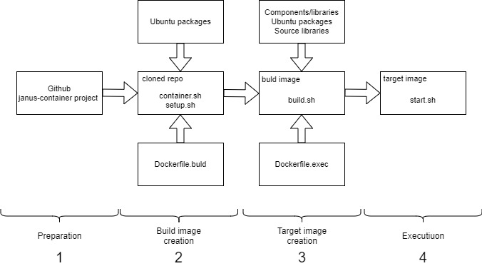
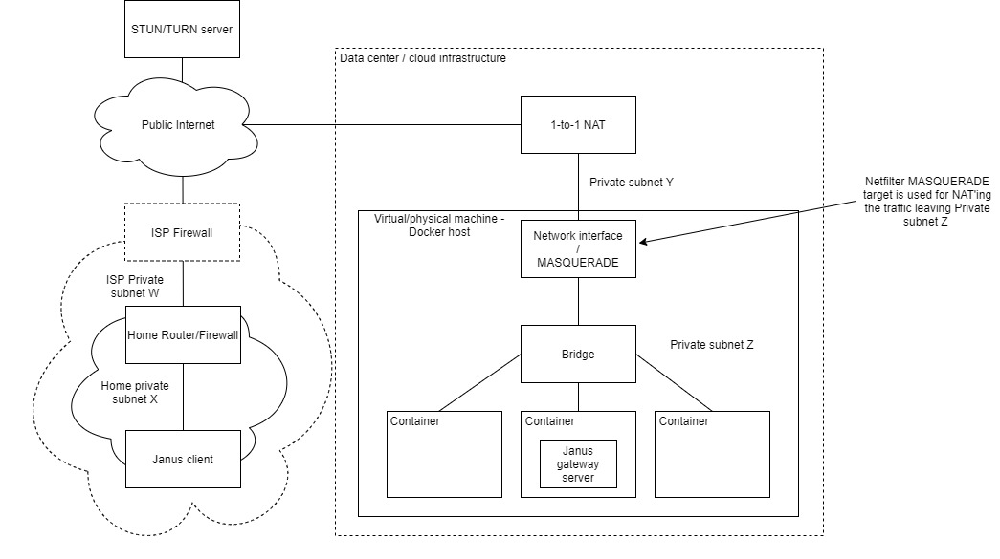

# Janus container

## Introduction
This project creates the Janus Gateway Docker image and provides the procedure to set up the container using the default *bridge* network driver. There are multiple 
advantages to support this configuration such as it avoids having to reserve dedicated IP address per container, configuring/parameterizing the image to use different
 sets of ports internally and makes automatic scaling much easier. The default *bridge* configuration has the most constraints hence images supporting it will support 
 most of other configurations.

The strategy followed in this project is to create a build Docker image (build image for short) first. The build image runs the Docker tools as well as the Janus build environment. 
It compiles and creates the target Janus gateway image (target image for short). This allows to create a substantially smaller target image than if a single image combining 
the build and execution was built (~300MB vs ~1.6GB). We provide two ways of building the images, the first one is manual that requires a Docker 
host that purpose is to build, store and run the target images. This build process is orchestrated by the _container.sh_ script. The second build method is directly using 
[GitLab](https://about.gitlab.com/) Continous Integration (CI) scheme orchestrated by the _.gitlab-ci.yml_ script. This method requires a GitLab setup that includes Kubernetes 
executors and has access to a registry (e.g. the GitLab internal container registry) for storing the created images. The second method also requires a Docker host for 
executing the target image.

Finally, at the bottom of this page in the _Experimentation and observations section_, we have added a discussion about some limitations that need to be considered 
when deploying the target image.

Notes:
* Please visit [Meetecho Janus project](https://janus.conf.meetecho.com/docs/) for a detailed description of the Janus gateway.
* Out-of-the-box this project provides the simplest single host Docker configuration which may be tailored to any other more complex configuration. The 
procedure below allows to setup a single host running the Janus Gateway in a Docker container accessed using HTTPS only and relying on the host for certificate management. 
This procedure may be greately simplified by modifying the Janus Gateway configuraiton to avoid mounting multiple host folders, avoiding the installation of Certbot and 
the HTTP server (Nginx) etc. and, allowing instead, to simply run the Janus Gateway image.
* Only the video room plug-in (and echo test plug-in) with HTTP transport have been tried. Possibly, other plug-ins and transports will require adjustments in the content of the 
target image (e.g. included Ubuntu packages).
* The author welcomes questions, comments and suggestions!

## Execution host setup
The figure below depicts the host configuration.


The host contains the following components:
* Docker engine for executing the build and target images.
* Nginx HTTP server for allowing Certbot automatic Letsencrypt certificates update and for serving the Janus HTML samples.
* Cetbot certificate renewal service.

The Janus target image mounts the following host volumes:
* */var/www/html/container* (to container */html*): Upon startup the target image copies the content of the folder containing the Janus HTML samples. This folder is accessible through HTTPS. 
Please note that the /var/www/html folder contains the Nginx default index.html page which is accessible through HTTP. Its purpose is to allow Letsencrypt host validation.
* */var/janus/recordings* (to container */janus/bin/janus-recordings*): This folder is used by the target image to store the video room recordings (when enabled).
* */etc/letsencrypt/live/* (to container */etc/certs*) and */etc/letsecrypt/archive* (to container */archive*): These folders contain the links and Letsencrypt certificates required for TLS and DTLS 
shared by both Nginx and Janus gateway
* *\<Janus config host folder\>* (to container */janus/etc/janus_host*: Optionally (when the _RUN_WITH_HOST_CONFIGURATION_DIR_ environment variable is set) 
the target image may mount a configuration folder from the host, this configuration will override the built-in configuration.

The Janus build image mounts the following host volume:
* */var/run/docker.sock* (to container */var/run/docker.sock*) enables the build image to use the Docker service from the host.
* *\<clone directory\>/janus_config*, when the BUILD_WITH_HOST_CONFIG_DIR build parameter is set to 'true' the host janus configuration directory will be mounted and used in the 
target image creation process instead of using the default configuration that has been embedded into the build image during the build image creation.

## Process
The figure below depicts the target image creation process.



The process consists in the following steps:
1. *Preparation*: The project is cloned from the Github repository. The default Janus gateway server configuration in _\<clone directory\>/janus_config_ sub-folder is reviewed and modified according 
to the requirements of the target image.  
1. *Build image creation*: Triggered by invoking the *container.sh* script. The build relies on *Dockerfile.build* and *setup.sh* scripts along with some environment variables (*see below*)
to install the necessary components of the build image. The Janus gateway configuration is copied into the build image, it will be used in the next step.
1. *Target Image creation*: Once the build image is created the *container.sh* script triggers the target image build process that relies on *Dockerfile.exec* and *build.sh* scripts, copied into the 
build image (_/image_ directory) in the previous step. In this step, the required version of the Janus software is cloned and checked out as specified by the _JANUS_REPO_ and _JANUS_VERSION_ environment variables.
Binary and source dependencies are fetched. The whole package is compiled and the target image is created. In this step, instead of using the embedded Janus gateway configuration it is possible, 
by defining the _BUILD_WITH_HOST_CONFIG_DIR_ variable, to mount the _\<clone directory\>/janus_config_, containing Janus gateway configuration. In that case configuration from the 
mounted directory will be copied into the target image.
1. *Target image execution*: The created target image contains a *start.sh* script that is configured as the entry point. This scripts copies the Janus HTML samples and invokes the Janus gateway application. If
_RUN_WITH_HOST_CONFIGURATION_DIR_ is set to "true" the *start.sh* script will use the Janus configuration host folder mounted inside the container at _/janus/etc/janus_host_ instead
of using the embedded configuration located in _/janus/etc/janus_ directory.

## Build/execution host installation
This section provides the default installation procedure. The default configuration allows to access the Janus Gateway server only through HTTPs using the host's 
obtanied Letsencrypt certificates. Please note that this project is using Ubuntu 18.04-LTS Linux distribution. Although it has been tried 
only on that specific version, a priori, there are no reasons for it not to work on any other recent version of the Ubuntu distribution.

1. Provision  Ubuntu 18.04 physical or virtual host with the default packages and using the default parameters. Make sure that you have 
access to a *sudo* capable user. We assume that the host is directly connected to the Internet through a 1-to-1 NAT. 
	1. Make sure that the 1-to-1 NAT redirects the following ports: 80 (http), 443 (https), 8089 (janus-api), 7889 (janus-admin) to the Janus host.
	1. Reserve a name for your host in your domain (e.g. \<host\>.\<domain\>) and update the */etc/hosts* file accordingly, for example:
		```bash
		127.0.0.1 localhost <host>.<domain>
		[...]
		```
1. Install Docker following [these](https://docs.docker.com/engine/install/ubuntu/) instructions then follow 
[these](https://docs.docker.com/engine/install/linux-postinstall/) steps for some additional convenience settings. Please note that the 
build process includes also the option to use Podman instead of Docker but Podman only allows to create the build image. It does not work 
yet for the target image creation. If yo wish to experiment with Podman you may use [these](https://podman.io/getting-started/installation.html)
installation instructions. Both Podman and Docker may be installed on the same host.
1. Install Nginx HTTP server. We need NGINX to automate the [Letsencrypt](https://letsencrypt.org/) certificate updates using the 
[Certbot](https://certbot.eff.org/) and for serving the janus HTML examples (from the /var/www/html/container host directory) 
	```bash
	sudo apt install nginx
	sudo apt update
	```
1. Install the TLS certificates and the automatic certificate update service
	1. Add the Certbot PPA to your list of repositories
		```bash
		sudo apt install software-properties-common
		sudo add-apt-repository universe
		sudo add-apt-repository ppa:certbot/certbot
		sudo apt update
		```
	1. Install Certbot
		```bash
		sudo apt install certbot python-certbot-nginx
		```
	1. Get the certificates
		```bash
		sudo certbot certonly --nginx
		```
		>>>
		Saving debug log to /var/log/letsencrypt/letsencrypt.log
		Plugins selected: Authenticator nginx, Installer nginx
		Enter email address (used for urgent renewal and security notices) (Enter 'c' to
		cancel): <b>\<your e-mail address\></b>

		- - - - - - - - - - - - - - - - - - - - - - - - - - - - - - - - - - - - - - - -
		Please read the Terms of Service at
		https://letsencrypt.org/documents/LE-SA-v1.2-November-15-2017.pdf. You must
		agree in order to register with the ACME server at
		https://acme-v02.api.letsencrypt.org/directory
		- - - - - - - - - - - - - - - - - - - - - - - - - - - - - - - - - - - - - - - -
		(A)gree/(C)ancel: <b>A</b>

		- - - - - - - - - - - - - - - - - - - - - - - - - - - - - - - - - - - - - - - -
		Would you be willing to share your email address with the Electronic Frontier
		Foundation, a founding partner of the Let's Encrypt project and the non-profit
		organization that develops Certbot? We'd like to send you email about our work
		encrypting the web, EFF news, campaigns, and ways to support digital freedom.
		- - - - - - - - - - - - - - - - - - - - - - - - - - - - - - - - - - - - - - - -
		(Y)es/(N)o: <b>N</b>
		No names were found in your configuration files. Please enter in your domain
		name(s) (comma and/or space separated) (Enter 'c' to cancel): <b>\<host\>.\<domain\></b>
		
		Obtaining a new certificate
		Performing the following challenges:
		http-01 challenge for bart-test-access.eastus.cloudapp.azure.com
		Waiting for verification...
		Cleaning up challenges

		IMPORTANT NOTES:
		- Congratulations! Your certificate and chain have been saved at:
		/etc/letsencrypt/live/bart-test-access.eastus.cloudapp.azure.com/fullchain.pem
		Your key file has been saved at:
		/etc/letsencrypt/live/bart-test-access.eastus.cloudapp.azure.com/privkey.pem
		Your cert will expire on 2020-05-04. To obtain a new or tweaked
		version of this certificate in the future, simply run certbot
		again. To non-interactively renew *all* of your certificates, run
		"certbot renew"
		- If you like Certbot, please consider supporting our work by:

		Donating to ISRG / Let's Encrypt: https://letsencrypt.org/donate
		Donating to EFF: https://eff.org/donate-le
		>>>
	1. As specified in the output above the certificates may be found here:
		```bash
		/etc/letsencrypt/live/<host>.<domain>/fullchain.pem
		/etc/letsencrypt/live/<host>.<domain>/privkey.pem
		```
	**These files are links from the */etc/letsencrypt/archive* directory.**
	
	**!!VERY IMPORTANT!! Make sure that NON _root_ users have _read_ access to the links and the certificates.**
	```bash
	chmod -R a+r+x /etc/letsencrypt/live
	chmod -R a+r+x /etc/letsencrypt/archive
	```
	1. You may test the Certbot certificate renewal by issuing the following command:
		```bash
		sudo certbot renew --dry-run --allow-subset-of-names
		```
1. Clone the project repo
	```bash
	git clone https://github.com/bartbalaz/janus-container.git <clone directory>
	cd <clone directory>
	```
1. Create a http server configuration
	1. Copy the configuration file 
		```bash
		sudo mkdir /var/www/html/container
		cd <clone directory>
		sudo cp ./scripts/nginx.conf /etc/nginx/sites-available/<host>.<domain>.conf
		sudo ln -s /etc/nginx/sites-available/<host>.<domain>.conf /etc/nginx/sites-enabled/
		```
		Note that the */var/www/html/container* directory will be used to store the Janus HTML samples.
	1. Edit the configuration file */etc/nginx/sites-available/\<host\>.\<domain\>.conf* and replace the *\<host\>.\<domain\>* place holder
	with your host and domain name.
	1. Restart the Nginx server
		```bash
		sudo systemctl restart nginx
		```
1. Create a recording folder
	```bash
	sudo mkdir -p /var/janus/recordings
	```
## Manual build procedure
This procedure allows to create build and target images on a simple Docker host.

1. Set the build parameters environment variables by issuing the _export_ command for each parameter or by editing the _\<clone directory\>/scripts/config_ file and 
issuing the _source_ command. All the available parameters are sumarized in the table below.
	```bash 
	# Set each parmeter individually 
	export SOME_PARAMETER=some_value
	
	# Or set all the parameters saved in the config file
	cd <clone directory>
	source scripts/config
	```

Parameter  | Mandatory (Y/N/C) | Default | Build step | Description 
 :---: | :---: | :---: | :---: |:--- 
_IMAGE_REGISTRY_ | N | not set | 2, 3 | Registry for storing both the build and target images, including the project/user folder if necessary (i.e. docker.io/some_project).
_IMAGE_REGISTRY_USER_ | N | not set | 2, 3 | Registry user name
_IMAGE_REGISTRY_PASSWORD_ | N | not set | 2, 3 | Registry user password
_BUILD_IMAGE_NAME_ | N | janus_build | 2, 3 | Name of the build image
_BUILD_IMAGE_TAG_ | N | latest | 2, 3 | The version to tag the build image with
_IMAGE_TOOL_ | N | docker | 2, 3 | Tool for creating and managing the images, either "podman", "docker" or "external" when image building is handled outside of the project scripts
_HOST_NAME_ | N | \<host\>.\<domain\> | 3 |  Name of the host in full fqdn format. This value is only used in displaying the execution command at the end of an successful build
_JANUS_REPO_ | N | https://github.com/meetecho/janus-gateway.git | 3 | Repository to fetch Janus gatway sources from
_JANUS_VERSION_ | N | master | 3 |  Version of the Janus gateway sources to checkout (e.g. v0.10.0). If none is specified the master branch latest available version will be used
_TARGET_IMAGE_NAME_ | N | janus | 3 | Target image name
_TARGET_IMAGE_TAG_ | N | latest | 3 | The version to tag the target image with
_SKIP_BUILD_IMAGE_ | N | false | 3 | When set to "true" the build image will not be build
_SKIP_TARGET_IMAGE_ | N | false | 3 | When set to "true" the target image will not be build
_BUILD_WITH_HOST_CONFIG_DIR_ | N | false | 3 | When set to "true" the build image will mount the host Janus gateway configuration directory (i.e. <clone directory>/janus-config) instead of using the one that was copied during the build image creation
_RUN_WITH_HOST_CONFIGURATION_DIR_ | N | false | 3 | When set to "true" the image execution command displayed at the end of the successful build will add an option to use host Janus server configuration directory (i.e. <clone directory>/janus-config) instead of the embedded configuration during the target image creation process

2. Review the Janus gateway configuration files stored in *<clone directory>/janus_config* directory these files will be integrated into the build image and into the target image.
1. Launch the build process, this process performs two steps: creates the build image (unless the *SKIP_BUILD_IMAGE* is set to *"true"*), 
then creates the target image (unless *SKIP_TARGET_IMAGE* is set to *"true"*). Both images will appear in the local image Docker registry (issue *"docker images"* to verify). To perform either 
step set the above mentioned *"SKIP_"* parameters to the appropriate values.
	```bash
	cd <clone directory>
	./container.sh
	```

## Gitlab CI build procedure
This procedure is integrated into GitLab and provides a full automation pipeline of the build and target images creation. The procedure relies 
on the [Kaniko](https://github.com/GoogleContainerTools/kaniko) tool for creating the container images. The main advantage of Kaniko is that 
it is self contained and does not require proviledged access to any host resources. The automation pipeline defined in the _.gitlab-ci.yml_ is 
divided into three steps that are triggered by committing two different types of tags:

1. Create the build image, triggered by committing a tag the has the form _build-x.y.z_. The resulting build image will be tagged with _build-x.y.z_ and _latest_ tags.
2. Create the target image content, triggered by committing a tag that has the form _x.y.z_.
3. Create the target image, triggered by the same tag as the previous step. The resulting target image will be tagged with _x.y.z_ and _latest_ tags.

As stated earlier, the automation relies on GitLab [Kubernetes executor](https://docs.gitlab.com/runner/executors/kubernetes.html). Although, we did not try, the GitLab Docker 
executor perhaps may also work.\
The following parameters have to be defined in your environment. Please note that the current CI configuration pushes the images to two registries (ACR and NCR) if you would
like to use a single registry instead simply remove the lines referring either to ACR or NCR from the _.gitlab-ci.yml_ file and ignore the related parameters below.

Parameter  | Description 
 :---: | :--- 
 ACR_AUTH | Base64 encoded value of ACR image registry credentials "<username>:<password>" values, see section "Define an image from a private Container Registry" on [this page](https://docs.gitlab.com/ee/ci/docker/using_docker_images.html)
 NCR_AUTH | Base64 encoded value of NCR image registry credentials "<username>:<password>" values, see section "Define an image from a private Container Registry" on [this page](https://docs.gitlab.com/ee/ci/docker/using_docker_images.html)
 ACR_REGISTRY | ACR registry location (e.g. "gcr.io") 
 NCR_REGISTRY | NCR registry location (e.g. "gcr.io") 
 ACR_PROJECT | The project in the ACR registry where the images will be stored (e.g. "some_project_name"), may be left empty
 NCR_PROJECT | The project in the NCR registry where the images will be stored (e.g. "some_project_name"), may be left empty
 DOCKER_AUTH_CONFIG | See section "Define an image from a private Container Registry" on [this page](https://docs.gitlab.com/ee/ci/docker/using_docker_images.html)
 JANUS_BUILD_IMAGE | Name of the Janus build image (e.g. "janus_build")
 JANUS_TARGET_IMAGE | Name of the Janus Gateway target image (e.g. "janus")
 JANUS_REPO | The repository to fetch the Janus Gateway source code (e.g. https://github.com/meetecho/janus-gateway.git)
 JANUS_VERSION | The Janus Gateway source code version to checkout (e.g. "v0.10.0")

**Please note that further tuning of the _.gitlab-ci.yml_ is required to fit into your setup. For example, you must set the right location and version of the build image and you may need to tag 
the jobs with different tags so they get picked up by the appropriate runner, set the right version of the janus buld image etc.**

## Running the target image on the build/execution host
1. Launch the target image by invoking either of the commands on the build/execution host that are displayed at the end of a **successful** manual
 target image build (if *SKIP_TARGET_IMAGE* was set to *"false"* or not exported). For example:
	```bash 
	docker run --rm -d -p 8089:8089 -p 7889:7889 -v /var/www/html/container:/html \
		-v /etc/letsencrypt/live/<host>.<domain>:/etc/certs \
		-v /etc/letsencrypt/archive:/archive \
		-v /var/janus/recordings:/janus/bin/janus-recordings \
		-v <clone folder>/janus_config:/janus/etc/janus_host -e "RUN_WITH_HOST_CONFIGURATION_DIR=true" \
		some.container.registry.com/janus:some_tag
	```
1. Try the image by browsing to *https://\<host\>.\<domain\>/container* Please note that:
	* By default the video room plugin configuration (configuration file: _\<clone directory\>/janus_config/janus.plugin.videoroom.jcfg_) is set to require string video room names which is not the Janus gateway default configuraiton.
	* The default configuration allows *only* HTTPS transport through secure ports 8089 - janus-api and 7889 - janus-admin.

## Quick Docker tips
1. List all the images available locally
	```bash
	docker images
	```
1. List all the containers that are stopped but have not been removed
	```bash
	docker ps -a
	```
1. Remove a stopped container
	```bash
	docker rm <first few chars of the container id as displayed by "ps" command>
	```
1. Remove an image
	```bash
	docker rmi <first few chars of the image id as displayed by "images" command>
	```
1. Stop a container
	```bash
	docker stop <first few chars of the container id as displayed by "ps" command>
	```
1. Start a container in interactive mode, that will be removed when stopped, overriding the defined entrypoint, exposes a port, mounts a volume and sets an environment variable
	```bash
	docker run --rm -it -p <host port>:<container port> -v <host volume/directory>:<container directory> -e "VARIABLE_NAME=VARIABLE_VALUE" --entrypoint <new entrypoint command (e.g. "/bin/bash"> <image name>:<image tag>
	```
1. Execute an interactive command in a running container
	```bash
	docker exec -it <first few chars of the container id as displayed by "ps" command> <command to execute (e.g. "/bin/bash")>
	```

## Experimentation and observations
The figure below shows the network configuraiton when running Janus gateway server in a Docker container configured with the default bridge network. The Docker host is a data center virtual machine 
accessible through a 1-to-1 NAT firewall. The Janus client is located in a private network that offers a simple/typical firewall. The default Docker bridge configuration provides a private subnet 
for the containers. The conainers may access the public network thanks to the netfilter MASQUERADE target NAT functionlity applied to any packets leaving the private subnet z. The container is 
configured to expose the Janus gateway control (e.g. 8089 for Janus API and 7889 for Janus admin) and initially media ports (e.g. 10000-12000). As you will see below one of our conclusions consists 
in not exposing the media ports. Janus gateway server is configured to run in tricke and full ICE mode.



The figure below shows a simplified successfull sequence where the ICE suceeds to establish bidirectional media streams between the client and the gateway.
1. The offer is issued by the client.
1. Based on the offer and/or trickled candidates the gateway sends STUN probes that cannot reach the client.
1. Eventually the gateway sends an aswer message that allows the client to start sending STUN probles.
1. Thanks to the gateway earlier STUN probes the client STUN probles reach the server (the firewall port is open).
1. Thanks to the client STUN probes (the firewall port is open) the gateway STUN probes are reaching the client.


The next figure shows the unsucessful sequence. 
1. This time the offer is sent by the gateway.
1. Based on the offer and/or trickled candidates the client sends STUN probes that cannot reach the gateway. These probes are rejected by the MASQUERADE netfilter target because the 1-to-1 NAT
firewall is configured to forward any media traffic to the gatway. An ICMP error message is generated for each rejected probe.
1. The client generates an answer.
1. Based on the answer and/or trickled candidates the gateway generates STUN probes that for some reason never make it to the client. 
1. The client STUN probes never make it to the gateway neither.


Therefore our initial analysis has lead us to the same concusion as presented in [this](https://www.slideshare.net/AlessandroAmirante/janus-docker-friends-or-foe) slide pack 
by Alessandro Amirante from Meetecho. Now, going a bit more into details the next figure below shows an excerpt of the packet capture at the virtual machine network interface. 
1. STUN probe sent by the client before the gateway had a chance to open the port. As presented in step 2 on the previous figure above.
1. An ICMP "destination unreachable" error is generated.
1. The gateway sends a STUN request to a STUN server to retrieve its server reflexive address and port.
1. The STUN server replies indicating the reflexive port is 20422
1. The gateway issues STUN probes from port 20422 to the client local addresses (local subnet 192.x.y.z and some VPN 10.x.y.z) which are unreachable because the client is on a private subnet.
1. The STUN probe destined to the client server reflexive (i.e. "reachable") address and port gets its source port **reassigned** to **1599** (instead of **20422**). 
This happens because the earlier STUN probe from the client destined to the gateway address and port 20422 has altered the state of the MASQUERADE netfilter target. Please note we were not
able to identify the reason for this behavior (e.g. security vunerability protection, standard specification, DOS attack protection etc.).


Therefore the client STUN probes are lost because of the race condition between the gateway opening firewall ports and the client sending STUN probles and because the MASQUERADE netfilter 
target does not allow a host from the private subnet to send packets to a remote host using the same quintuple (source address, destination address, source port, destination port, protocol) 
as the one recently rejected from the remote host. On the other hand the server STUN probles are most probably rejected by the client side firewall because its NAT configuraiton is port restricted. 

## Solutions
In an attempt to eliminate the root cause and to delay the STUN client probes we have configred the gateway to trickle the candidates, which was unsuficient. Therefore we have also
 added an addional 1s delay in the client (janus.js file) when processing the received trickle candidates from the gateway. While this is not an acceptable solution the problem appeares to be solved.
1. The gateway sends the offer.
1. The gateway starts trickling the candidates. But the processing of the received tricked candidates is delayed by 1s at the client.
1. The client issues an answer.
1. The gatway sends a STUN probe that does not reach the client because the firewall port is still closed because of the delay.
1. After the delay has expired the client sends a STUN probe that opens the firewall port and reaches the gatway.
1. Finally the server resends a STUN proble that this time reaches the client.


The second solution consists in reconfiguring the 1-to-1 NAT firewall to disallow exposing any ports besides 80 (http), 443 (https), 8089 (janus-api) and 7889 (janus-admin). All the other ports
require the gateway to send an initial "opening" request.
1. The gateway sends the offer.
1. Based on the offer and/or tricked candidates the client sends STUN probes to the gatway. All these probes get filtered out by the 1-to-1 NAT and hence don't cause the 
above mentioned issue any more.
1. The client sends an answer to the gatway.
1. Based on the answer and/or trickled candidates the gatweay sends STUN probes to the client.
1. The client resends the STUN probes that this time reach the server.


## Conclusion
It is possible to use the default Docker bridged network driver but some conditions have to be met by the infrastructure specifically the firwall leading to the Janus gatway server. 
The firewall has to be able to block the client requests without triggering a port change as it happens with the MASQUERADE netfilter target. 


