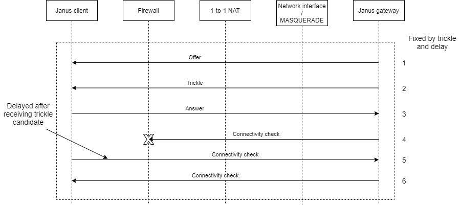

# Janus container

## Introduction
This project creates the Janus gateway Docker image and provides the procedure to set up the container using the default *bridge* network driver. There are multiple advantages to support this
configuration such as it avoids having to reserve dedicated IP address per container, configuring/parameterizing the image to use different sets of ports and makes automatic scaling much easier. 
The default *bridge* configuration has the most constraints so basically if an image supports it that image will support all other configurations.

The strategy followed in this project is to create a build Docker image (build image for short) first. The build image runs the Docker tools as well as the Janus build environment. It
compiles and creates the target Janus gateway image (target image for short) stored on the host image repository. This allows to create a substantially smaller target image than if a single image
 combining the build and execution was built (~300MB vs ~1.6GB). A build image may also be used in a CI/CD pipline for test and deployment automation. This process requires the setup of a 
 Docker host that purpose is to store the build and target images as well as to allow the execution of the target image for the purpose of testing and experimentation.

Please note:
* Please visit [Meetecho Janus project](https://janus.conf.meetecho.com/docs/) for a detailed description of the Janus gateway.
* Out-of-the-box this project provides the simplest single host Docker configuration which may be tailored to any other more complex configurations.
* Only the video room plugin (and echo test plugin) with HTTP transport have been tried. Possibly, other plugins and transports may require adjustments in the content of the 
target image (e.g. included Ubuntu packages).
* At the bottom of this page in the Experimentation and observations section, we have added a dicussion about some limitations that need to be considered when deploying the target image.
* The author welcomes comments and sugestions!

## Host setup
The figure below depicts the host configuration.


The host contains the following componets:
* Docker engine for executing the build and target images.
* Nginx HTTP server for allowing Certbot automatic Letsencrypt certificates update and for serving the Janus HTML samples.
* Cetbot certificate renewal service.

The Janus target image mounts the following host volumes:
* */var/www/html/container* (to container */html*): Upon startup the target image copies the content of the folder containing the Janus HTML samples. This folder is accessible through HTTPS. 
Please note that the /var/www/html folder contains the Nginx default index.html page which is accessible through HTTP. Its purpose is to allow Letsencrypt host validation.
* */var/janus/recordings* (to container */janus/bin/janus-recordings*): This folder is used by the target image to store the video room recordings (when enabled).
* */etc/letsencrypt/live/* (to container */etc/certs*) and */etc/letsecrypt/archive* (to container */archive*): These folders contain the links and actual Letsencrypt certificates requried for TLS and DTLS shared by both Nginx and Janus gateway
The Janus build image mounts the following host volume:
* */var/run/docker.sock* (to container */var/run/docker.sock*) enables the build image to use the Docker service from the host.
* *\<clone directory\>/janus_config*, when the USE_HOST_CONFIG_DIR build parameter is set to 'true' the host janus configuration directory will be mounted and used in the 
target image cration process.

## Process
The figure below depicts the target image creation process.


The process consists in the following steps:
1. The project is cloned from the Github repository. The default Janus gatway server configuration in *\<clone directory\>/janus_config* subfolder is reviewed and modified according 
to the requirements of the target image. This folder is copied into the build image and will be used in the target image creation. Instead of using the copied conted during 
the build image creation, by defining the USE_HOST_CONFIG_DIR variable (see below), it is possible to mount the *\<clone directory\>/janus_config* during the target image creation process.
1. The build image creation is triggered by setting some required environment variables and invoking the *container.sh* script. The build relies on *Dockerfile.build* and *setup.sh* scripts 
to install the necessary components in the build image. 
1. Once the build image is created the *container.sh* script triggers the target image build process that relies on *Dockerfile.exec* and *build.sh* scripts, copied into the build image in the previous step. 
1. The created image contains a *start.sh* script that is configured as the entry point. This scripts copies the Janus HTML samples and invokes the Janus gateway application.

## Installation procedure
This section provides the default installation procedure. The default configuration allows to access the server only through HTTPs using the host's 
obtanied Letsencrypt certificates. Please note that this project is using Ubuntu 18.04-LTS Linux distribution. Although it has been tried 
only on that specific version, a priori, there are no reasons for it not to work on any other recent version of the Ubuntu distribution.

### Build/docker experimental host installation
First let's install a Janus host for building and running the docker image. 
1. Install Ubuntu 18.04 physical or virtual host with the default packages and using the default parameters. Make sure that you have 
access to a *sudo* capable user. We assume that the host is directly connected to the internet through a 1-to-1 NAT. 
	1. Make sure that the 1-to-1 NAT redirects the following ports: 80 (http), 443 (https), 8089 (janus-api), 7889 (janus-admin) to the Janus host.
	1. Reserve a name for your host in your domain (e.g. \<host\>.\<domain\>) and update the */etc/hosts* file accordingly, for example:
		```bash
		127.0.0.1 localhost <host>.<domain>
		[...]
		```
1. Install Docker following [these](https://docs.docker.com/engine/install/ubuntu/) instructions then follow [these](https://docs.docker.com/engine/install/linux-postinstall/)
steps for some additional convenience settings.
1. Install Nginx HTTP server. We need NGINX to automate the [Letsencrypt](https://letsencrypt.org/) certificate updates using the 
[Certbot](https://certbot.eff.org/) and for serving the janus HTML examples (from the /var/www/html/container host directory) 
	```bash
	sudo apt install nginx
	sudo apt update
	```
1. Install the TLS certificates and the automatic certificate update service
	1. Add the Certbot PPA to your list of repositories
		```bash
		sudo apt install software-properties-common
		sudo add-apt-repository universe
		sudo add-apt-repository ppa:certbot/certbot
		sudo apt update
		```
	1. Install Certbot
		```bash
		sudo apt install certbot python-certbot-nginx
		```
	1. Get the certificates
		```bash
		sudo certbot certonly --nginx
		```
		>>>
		Saving debug log to /var/log/letsencrypt/letsencrypt.log
		Plugins selected: Authenticator nginx, Installer nginx
		Enter email address (used for urgent renewal and security notices) (Enter 'c' to
		cancel): <b>\<your e-mail address\></b>

		- - - - - - - - - - - - - - - - - - - - - - - - - - - - - - - - - - - - - - - -
		Please read the Terms of Service at
		https://letsencrypt.org/documents/LE-SA-v1.2-November-15-2017.pdf. You must
		agree in order to register with the ACME server at
		https://acme-v02.api.letsencrypt.org/directory
		- - - - - - - - - - - - - - - - - - - - - - - - - - - - - - - - - - - - - - - -
		(A)gree/(C)ancel: <b>A</b>

		- - - - - - - - - - - - - - - - - - - - - - - - - - - - - - - - - - - - - - - -
		Would you be willing to share your email address with the Electronic Frontier
		Foundation, a founding partner of the Let's Encrypt project and the non-profit
		organization that develops Certbot? We'd like to send you email about our work
		encrypting the web, EFF news, campaigns, and ways to support digital freedom.
		- - - - - - - - - - - - - - - - - - - - - - - - - - - - - - - - - - - - - - - -
		(Y)es/(N)o: <b>N</b>
		No names were found in your configuration files. Please enter in your domain
		name(s) (comma and/or space separated) (Enter 'c' to cancel): <b>\<host\>.\<domain\></b>
		
		Obtaining a new certificate
		Performing the following challenges:
		http-01 challenge for bart-test-access.eastus.cloudapp.azure.com
		Waiting for verification...
		Cleaning up challenges

		IMPORTANT NOTES:
		- Congratulations! Your certificate and chain have been saved at:
		/etc/letsencrypt/live/bart-test-access.eastus.cloudapp.azure.com/fullchain.pem
		Your key file has been saved at:
		/etc/letsencrypt/live/bart-test-access.eastus.cloudapp.azure.com/privkey.pem
		Your cert will expire on 2020-05-04. To obtain a new or tweaked
		version of this certificate in the future, simply run certbot
		again. To non-interactively renew *all* of your certificates, run
		"certbot renew"
		- If you like Certbot, please consider supporting our work by:

		Donating to ISRG / Let's Encrypt: https://letsencrypt.org/donate
		Donating to EFF: https://eff.org/donate-le
		>>>
	1. As specified in the output above the certificates may be found here:
		```bash
		/etc/letsencrypt/live/<host>.<domain>/fullchain.pem
		/etc/letsencrypt/live/<host>.<domain>/privkey.pem
		```
	**These files are links from the */etc/letsencrypt/archive* directory.**
	
	**!!VERY IMPORTANT!! Make sure the NON *root* user has read access to the links and the certificates.**
	```bash
	chmod -R a+r+x /etc/letsencrypt/live
	chmod -R a+r+x /etc/letsencrypt/archive
	```
	1. You may test the Certbot certificate renewal by issuing the following command:
		```bash
		sudo certbot renew --dry-run --allow-subset-of-names
		```
1. Clone the project repo
	```bash
	git clone https://github.com/bartbalaz/janus-container.git <clone directory>
	cd <clone directory>
	```
1. Create a http server configuration
	1. Copy the configuration file 
		```bash
		sudo mkdir /var/www/html/container
		cd <clone directory>
		sudo cp ./scripts/nginx.conf /etc/nginx/sites-available/<host>.<domain>.conf
		sudo ln -s /etc/nginx/sites-available/<host>.<domain>.conf /etc/nginx/sites-enabled/
		```
		Note that the */var/www/html/container* directory will be used to store the Janus HTML samples.
	1. Edit the configuration file */etc/nginx/sites-available/\<host\>.\<domain\>.conf* and replace the *\<host\>.\<domain\>* place holder
	with your host and domain name.
	1. Restart the Nginx server
		```bash
		sudo systemctl restart nginx
		```
1. Create a recording folder
	```bash
	sudo mkdir -p /var/janus/recordings
	```
## Build procedure
1. Set the build parameters
	```bash
	export JANUS_REPO = # Repository to fetch Janus gatway sources from (e.g. https://github.com/bartbalaz/janus-gateway.git). If none is specified the default Meetech Janus gateway repository will be used
	export JANUS_VERSION = # Version of the Janus gateway sources to checkout (e.g. v0.10.0). If none is specified the master branch latest available version will be used.
	export TARGET_IMAGE_NAME = # Target image name (e.g. janus), must be specified.
	export TARGET_IMAGE_VERSION = # The version to tag the target image with (e.g. 01), must be specified.
	export BUILD_IMAGE_NAME = # Name of the build image (e.g. janus_build), must be specified.
	export BUILD_IMAGE_VERSION = # The version to tag the build image with (e.g. 01), must be specified.
	export HOST_NAME = # Name of the host including the fqdn (e.g. <host>.<domain>), must be specified.
	export SKIP_BUILD_IMAGE = # When set to "true" the build image will not be built
	export SKIP_TARGET_IMAGE = # When set to "true" the target image will not be build
	export USE_HOST_CONFIG_DIR = #When set to 'true' the build image will mount the host Janus gatway configuration directory (e.g. <clone directory>/janus-config) instead of using the one that was copied during the build image creation
	```
1. Review the Janus gateway configuration files stored in *<clone directory>/janus_config* directory these files will be integrated into the target image.
1. Launch the build process, this process performs two steps: creates the build image (unless the *SKIP_BUILD_IMAGE* is set to *"true"*), 
then creates the target image (unless *SKIP_TARGET_IMAGE* is set to *"true"*). Both images will appear in the local image Docker registry (issue *"docker images"* to verify). To perform either 
step set the above mentioned *"SKIP_"* parameters to the appropriate values.
	```bash
	cd <clone directory>
	./container.sh
	```
1. Launch the target image by invoking either of the commands that are displayed at the end of a **successful** target image build (if *SKIP_TARGET_IMAGE* was set to *"false"* or not exported).
1. Try the image by browsing to *https://\<host\>.\<domain\>* Please note that:
	* By default the video room plugin configuration (configuration file: "janus.plugin.videoroom.jcfg") is set to require string video room names which is not the Janus gateway default configuraiton.
	* The default configuration allows only HTTPS transport through secure ports 8089 - janus-api and 7889 - janus-admin.

## Experimentation and observations
The figure below shows the network configuraiton when running Janus gateway server in a Docker container configured with the default bridge network. The Docker host is a data center virtual machine 
accessible through a 1-to-1 NAT firewall. The Janus client is located in a private network that offers a simple/typical firewall. The default Docker bridge configuration provides a private subnet 
for the containers. The conainers may access the public network thanks to the netfilter MASQUERADE target NAT functionlity applied to any packets leaving the private subnet z. The container is 
configured to expose the Janus gateway control (e.g. 8089 for Janus API and 7889 for Janus admin) and initially media ports (e.g. 10000-12000). As you will see below one of our conclusions consists 
in not exposing the media ports. Janus gateway server is configured to run in tricke and full ICE mode.


The figure below shows a simplified successfull sequence where the ICE suceeds to establish bidirectional media streams between the client and the gateway.
1. The offer is issued by the client.
1. Based on the offer and/or trickled candidates the gateway sends STUN probes that cannot reach the client.
1. Eventually the gateway sends an aswer message that allows the client to start sending STUN probles.
1. Thanks to the gateway earlier STUN probes the client STUN probles reach the server (the firewall port is open).
1. Thanks to the client STUN probes (the firewall port is open) the gateway STUN probes are reaching the client.


The next figure shows the unsucessful sequence. 
1. This time the offer is sent by the gateway.
1. Based on the offer and/or trickled candidates the client sends STUN probes that cannot reach the gateway. These probes are rejected by the MASQUERADE netfilter target because the 1-to-1 NAT
firewall is configured to forward any media traffic to the gatway. An ICMP error message is generated for each rejected probe.
1. The client generates an answer.
1. Based on the answer and/or trickled candidates the gateway generates STUN probes that for some reason never make it to the client. 
1. The client STUN probes never make it to the gateway neither.


Therefore our initial analysis has lead us to the same concusion as presented in [this](https://www.slideshare.net/AlessandroAmirante/janus-docker-friends-or-foe) slide pack 
by Alessandro Amirante from Meetecho. Now, going a bit more into details the next figure below shows an excerpt of the packet capture at the virtual machine network interface. 
1. STUN probe sent by the client before the gateway had a chance to open the port. As presented in step 2 on the previous figure above.
1. An ICMP "destination unreachable" error is generated.
1. The gateway sends a STUN request to a STUN server to retrieve its server reflexive address and port.
1. The STUN server replies indicating the reflexive port is 20422
1. The gateway issues STUN probes from port 20422 to the client local addresses (local subnet 192.x.y.z and some VPN 10.x.y.z) which are unreachable because the client is on a private subnet.
1. The STUN probe destined to the client server reflexive (i.e. "reachable") address and port gets its source port **reassigned** to **1599** (instead of **20422**). 
This happens because the earlier STUN probe from the client destined to the gateway address and port 20422 has altered the state of the MASQUERADE netfilter target. Please note we were not
able to identify the reason for this behavior (e.g. security vunerability protection, standard specification, DOS attack protection etc.).


Therefore the client STUN probes are lost because of the race condition between the gateway opening firewall ports and the client sending STUN probles and because the MASQUERADE netfilter 
target does not allow a host from the private subnet to send packets to a remote host using the same quintuple (source address, destination address, source port, destination port, protocol) 
as the one recently rejected from the remote host. On the other hand the server STUN probles are most probably rejected by the client side firewall because its NAT configuraiton is port restricted. 

## Solutions
In an attempt to eliminate the root cause and to delay the STUN client probes we have configred the gateway to trickle the candidates, which was unsuficient. Therefore we have also
 added an addional 1s delay in the client (janus.js file) when processing the received trickle candidates from the gateway. While this is not an acceptable solution the problem appeares to be solved.
1. The gateway sends the offer.
1. The gateway starts trickling the candidates. But the processing of the received tricked candidates is delayed by 1s at the client.
1. The client issues an answer.
1. The gatway sends a STUN probe that does not reach the client because the firewall port is still closed because of the delay.
1. After the delay has expired the client sends a STUN probe that opens the firewall port and reaches the gatway.
1. Finally the server resends a STUN proble that this time reaches the client.



The second solution consists in reconfiguring the 1-to-1 NAT firewall to disallow exposing any ports besides 80 (http), 443 (https), 8089 (janus-api) and 7889 (janus-admin). All the other ports
require the gateway to send an initial "opening" request.
1. The gateway sends the offer.
1. Based on the offer and/or tricked candidates the client sends STUN probes to the gatway. All these probes get filtered out by the 1-to-1 NAT and hence don't cause the 
above mentioned issue any more.
1. The client sends an answer to the gatway.
1. Based on the answer and/or trickled candidates the gatweay sends STUN probes to the client.
1. The client resends the STUN probes that this time reach the server.


## Conclusion
It is possible to use the default Docker bridged network driver but some conditions have to be met by the infrastructure specifically the firwall leading to the Janus gatway server. 
The firewall has to be able to block the client requests without triggering a port change as it happens with the MASQUERADE netfilter target. 


