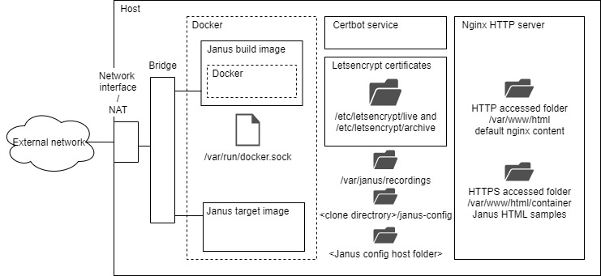

# Janus container

## Introduction
This is an experimental project attempting to put Janus gatweay into a Docker container using the default *bridge* network driver. The strategy is to 
create a build Docker image, build image for short, that will run the Docker tools as well as the Janus build environment. The build image will compile and create the target Janus gateway 
image, target image for short, stored on the host image repository. This allows to create a substantially smaller target image than if a single image combining the build and execution 
was built (~300MB vs ~1.6GB). 
This process requires the setup of a Docker host that purpose is to store the buld and target images as well as to allow the execution of the target image for 
the purpose of experimentation. 

Please note:
* This project is **work in progress**
* Only the video room with HTTP transport has been tried. Possibly other transports will require adjustments in the content of the target image (e.g. included Ubuntu packages)
* The author welcomes any comments and sugestions!

## Host setup
The figure below depicts the host configuration.



The host contains the following componets:
* Docker engine for executing the build and target images.
* Nginx HTTP server for allowing Certbot automatic Letsencrypt certificates update and for serving the Janus HTML samples
* Cetbot certificate renewal service

The Janus target image mounts the following volumes:
* /var/www/html/container: Upon startup the target image copies the content of the folder containing the Janus HTML samples. This folder is accessible through HTTPS. 
Please note that the /var/www/html folder contains the Nginx default index.html page, it is accessible through HTTP. Its purpose is to allow Letsencrypt host validation.
* /var/janus/recordings: This folder is used by the target image to store the video room recordings (when enabled).
* /etc/letsencrypt/live/ and /etc/letsecrypt/archive: These folders contain the links and actual Letsencrypt certificates requried for TLS and DTLS shared by both Nginx and Janus gateway
* /var/run/docker.sock enables the build image to use the host Docker service

## Process
The figure below depicts the target image creation process.


The process consists in the following steps:
1. The project is cloned from the Github repository.
1. The build image creation is triggered by setting some required environment variables and invoking the *container.sh* script. The build relies on *Dockerfile.build* and *setup.sh* scripts 
to install the necessary components in the build image. 
1. Once the build image is created the *container.sh* script triggers the target image build process that relies on *Dockerfile.exec* and *build.sh* scripts, copied into the build image in the previous step, 
to perform the required build steps. 
1. The created image contains a *start.sh* script that is configured as the entry point. This scripts copies the Janus HTML samples and invokes the Janus gateway application.

## Installation procedure
This section provides the default installation procedure. The default configuration allows to access the server only through HTTPs using the host's 
obtanied Letsencrypt certificates. Please note that this project is using Ubuntu 18.04-LTS Linux distribution. Although it has been tried 
only on that specific distribution, a priori, there are no reasons for it not to work on any other recent distributions.

### Build/docker experimental host installation
First let's install a Janus host for building and running the docker image. 
1. Install Ubuntu 18.04 physical or virtual host with the default packages and using the default parameters. Make sure that you have 
access to a sudo capable user. We assume that the host is directly connected to the internet through a 1-to-1 NAT. 
	1. Make sure that the 1-to-1 NAT redirects the following ports: 80 (http), 443 (https), 8089 (janus-api), 7889 (janus-admin) to the Janus host.
	1. Reserve a name for your host in your domain (e.g. <host>.<domain>) and update the */etc/hosts* file accordingly
		```bash
		127.0.0.1 localhost <host>.<domain>
		[...]
		```
1. Install docker following [these](https://docs.docker.com/engine/install/ubuntu/) instructions then follow [these](https://docs.docker.com/engine/install/linux-postinstall/)
steps for some additional convenience settings.
1. Install Nginx HTTP server. We need NGINX to automate the [Letsencrypt](https://letsencrypt.org/) certificate updates using the 
[Certbot](https://certbot.eff.org/) and for serving the janus html examples (from the /var/www/html/container directory) 
	```bash
	sudo apt install nginx
	sudo apt update
	```
1. Install the TLS certificates and the automatic certificate update service
	1. Add the Certbot PPA to your list of repositories
		```bash
		sudo apt install software-properties-common
		sudo add-apt-repository universe
		sudo add-apt-repository ppa:certbot/certbot
		sudo apt update
		```
	1. Install Certbot
		```bash
		sudo apt install certbot python-certbot-nginx
		```
	1. Get the certificates
		>>>
		<b>sudo certbot certonly --nginx</b>
		
		Saving debug log to /var/log/letsencrypt/letsencrypt.log
		Plugins selected: Authenticator nginx, Installer nginx
		Enter email address (used for urgent renewal and security notices) (Enter 'c' to
		cancel): <b>\<your e-mail address\></b>

		- - - - - - - - - - - - - - - - - - - - - - - - - - - - - - - - - - - - - - - -
		Please read the Terms of Service at
		https://letsencrypt.org/documents/LE-SA-v1.2-November-15-2017.pdf. You must
		agree in order to register with the ACME server at
		https://acme-v02.api.letsencrypt.org/directory
		- - - - - - - - - - - - - - - - - - - - - - - - - - - - - - - - - - - - - - - -
		(A)gree/(C)ancel: <b>A</b>

		- - - - - - - - - - - - - - - - - - - - - - - - - - - - - - - - - - - - - - - -
		Would you be willing to share your email address with the Electronic Frontier
		Foundation, a founding partner of the Let's Encrypt project and the non-profit
		organization that develops Certbot? We'd like to send you email about our work
		encrypting the web, EFF news, campaigns, and ways to support digital freedom.
		- - - - - - - - - - - - - - - - - - - - - - - - - - - - - - - - - - - - - - - -
		(Y)es/(N)o: <b>N</b>
		No names were found in your configuration files. Please enter in your domain
		name(s) (comma and/or space separated) (Enter 'c' to cancel): <b>\<host\>.\<domain\></b>
		
		Obtaining a new certificate
		Performing the following challenges:
		http-01 challenge for bart-test-access.eastus.cloudapp.azure.com
		Waiting for verification...
		Cleaning up challenges

		IMPORTANT NOTES:
		- Congratulations! Your certificate and chain have been saved at:
		/etc/letsencrypt/live/bart-test-access.eastus.cloudapp.azure.com/fullchain.pem
		Your key file has been saved at:
		/etc/letsencrypt/live/bart-test-access.eastus.cloudapp.azure.com/privkey.pem
		Your cert will expire on 2020-05-04. To obtain a new or tweaked
		version of this certificate in the future, simply run certbot
		again. To non-interactively renew *all* of your certificates, run
		"certbot renew"
		- If you like Certbot, please consider supporting our work by:

		Donating to ISRG / Let's Encrypt: https://letsencrypt.org/donate
		Donating to EFF: https://eff.org/donate-le
		>>>
	1. As specified in the output above the certificates may be found here:
		```bash
		/etc/letsencrypt/live/<host>.<domain>/fullchain.pem
		/etc/letsencrypt/live/<host>.<domain>/privkey.pem
		```
	**These files are links from the */etc/letsencrypt/live/archive* directory.  !!VERY IMPORTANT!! Make sure the non *root* user has 
	read access to the links and the certificates.**
	1. You may test the Certbot certificate renewal by issuing the following command:
		```bash
		certbot renew --dry-run --allow-subset-of-names
		```
1. Clone the project repo
	```bash
	git clone https://github.com/bartbalaz/janus-container.git <checkout directory>
	cd <checkout directory>
	```
1. Create a http server configuration
	1. Copy the configuration file 
		```bash
		sudo mkdir /var/www/html/container
		cd <checkout directory>
		sudo cp ./scripts/nginx.conf /etc/nginx/sites-available/<host>.<domain>.conf
		sudo ln -s /etc/nginx/sites-available/<host>.<domain>.conf /etc/nginx/sites-enabled/
		```
		Note that the */var/www/html/container* directory will be used to store the Janus HTML samples.
	1. Edit the configuration file */etc/nginx/sites-available/\<host\>.\<domain\>.conf* and replace the *\<host\>.\<domain\>* place holder
	with your host and domain name.
	1. Restart the Nginx server
		```bash
		sudo systemctl restart nginx
		```
1. Create a recording folder
	```bash
	sudo mkdir -p /var/janus/recordings
	```
## Build procedure
1. Define the build parameters
	```bash
	export JANUS_REPO = # Repository to fetch Janus gatweay sources from (e.g. https://github.com/bartbalaz/janus-gateway.git). If none is specified the default Meetech Janus gateway repository will be used
	export JANUS_VERSION = # Version of the Janus gateway sources to checkout (e.g. v0.10.0). If none is specified the master branch latest available version will be used.
	export TARGET_IMAGE_NAME = # Target image name (e.g. janus), must be specified.
	export TARGET_IMAGE_VERSION = # The version to tag the target image with (e.g. 01), must be specified.
	export BUILD_IMAGE_NAME = # Name of the build image (e.g. janus_build), must be specified.
	export BUILD_IMAGE_VERSION = # The version to tag the build image with (e.g. 01), must be specified.
	export HOST_NAME = # Name of the host including the fqdn (e.g. <host>.<domain>), must be specified.
	export SKIP_BUILD_IMAGE = # When set to "true" the build image will not be built
	export SKIP_TARGET_IMAGE = # When set to "true" the target image will not be build
	```
1. Review the Janus gateway configuration files stored in *<checkout directory>/janus_config* directory these files will be integrated into the target image.
1. Launch the build process
	```bash
	cd <checkout directory>
	./container.sh
	```
1. Launch the image by invoking either of the commands that are displayed at the end of a successful build.
1. Try the image by browsing to *https://\<host\>.\<domain\>* Please note that:
	* The video room plugin configuration is set to require string video room names which is not the Janus gateway default configuraiton.
	* The default configuration allows only HTTPS transport through secure ports 8089 - janus-api and 7889 - janus-admin.

## Experimentation and observations
The figure below shows the network configuraiton when running Janus gateway server in a Docker contaier configured with the default bridge network. The Docker host is a data center virtual machine 
accessible through a 1-to-1 NAT firewall. The Janus client is located in a private network that offers a simple/typical firewall. The default Docker bridge configuration provides a private subnet 
for the containers. The conainers may access the public network thanks to the netfilter MASQUERADE target NAT functionlity applied to any packets leaving the private subnet z. The container is 
configured to expose the Janus gateway control (e.g. 8089 for Janus API and 7889 for Janus admin) and initially media ports (e.g. 10000-12000). As you will see below one of our solutions consists 
in not exposing the media ports. 


The figure below shows a simplified successfull sequence where the ICE suceeds and bidirectional media stream is flowing between the client and the gateway.
1. The offer is issued by the client.
1. Based on the offer and/or tricked candidates the gateway sends STUN probes that cannot reach the client.
1. Eventually the gateway sends an aswer message that allows the client to start sending STUN probles.
1. Thanks to the gateway earlier STUN probes the client STUN probles reach the server (the firewall port is open).
1. Thanks to the client STUN probes (the firewall port is open) the gateway STUN probes are reaching the client.


The next figure shows the unsucessful sequence. 
1. This time the offer is sent by the gateway.
1. Based on the offer and/or tricked candidates the client sends STUN probes that cannot reach the gateway. These probes are rejected by the MASQUERADE netfilter target because the 1-to-1 NAT
firewall is configured to forward any media traffic to the gatway. An ICMP message is generated for each probe.
1. The client generates an answer.
1. Based on the answer the gateway generates the STUN probes that for some reason never make it to the client. 
1. The client STUN probes never make it to the gateway neither.


Therefore our initial analysis has lead us to the same concusion as [this](https://www.slideshare.net/AlessandroAmirante/janus-docker-friends-or-foe) presentation 
by Alessandro Amirante from Meetecho. Now, going a bit more into details the next figure below shows an exceprt of the packet capture at the virtual machine network interface. 
1. Probe sent by the client before the gateway had a chance to open the port. As presented in step 2 on the previous figure above.
1. The ICMP error message is generated.
1. The gateway issues a STUN request to a STUN server.
1. The STUN server replies the server reflexive port is 20422
1. The gateway issues STUN probes from 20422 to the client local (i.e. "unreachable" because the client is behind a firewall and uses private addresses) addresses.
1. The STUN probe targeting the client server reflexive (i.e. "reachable") address gets its source port switched to **1599** (instead of 20422 as reported by the STUN server), 
because of the earlier received message from the targeted address and port.


Therefore because of the race condition created by the STUN probes issued by the client prior to the gatway opening the ports and because of the behavior of the MASQUARADE netfilter target the 
gateway issued STUN probes get their port wrongly reassigned. These probes most probably cannot reach the client because of the firewall on the client side that may be port restrictive. 


## Conclusion


